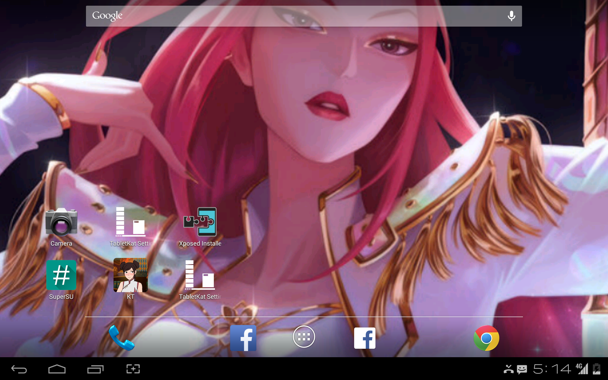
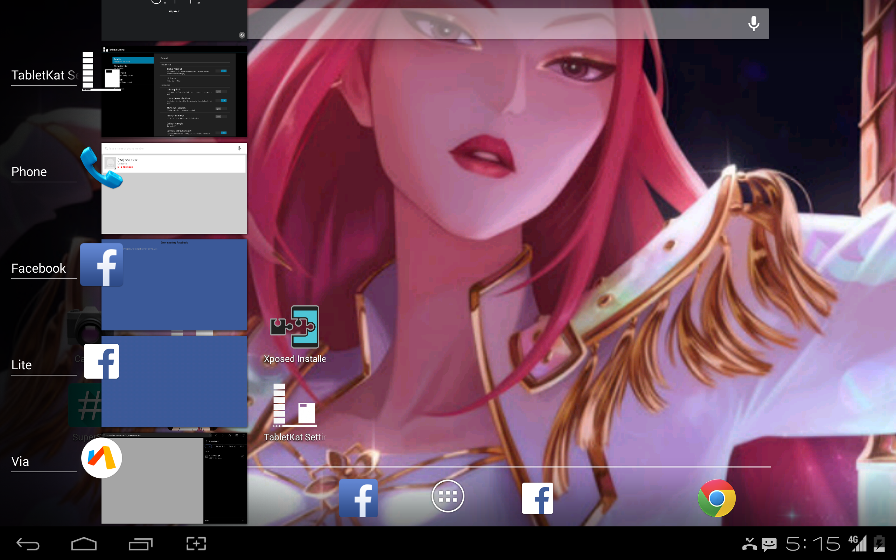
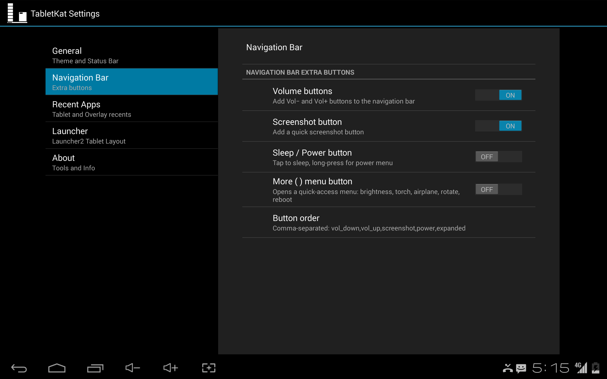
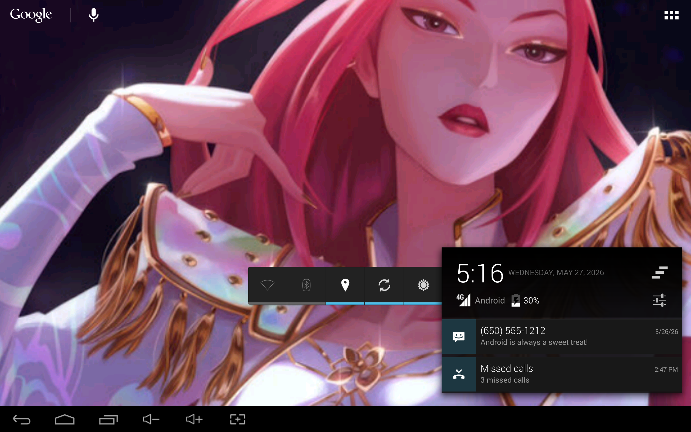
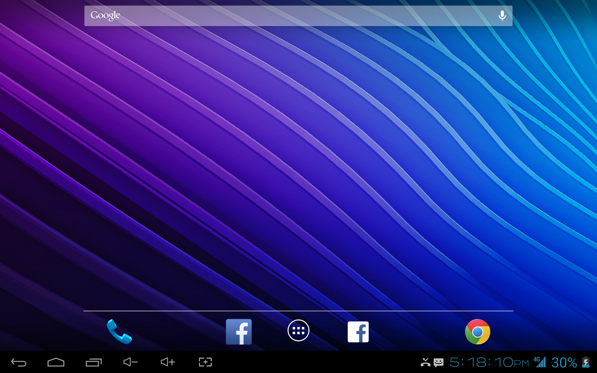
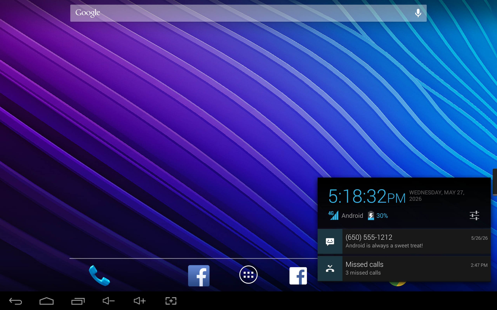
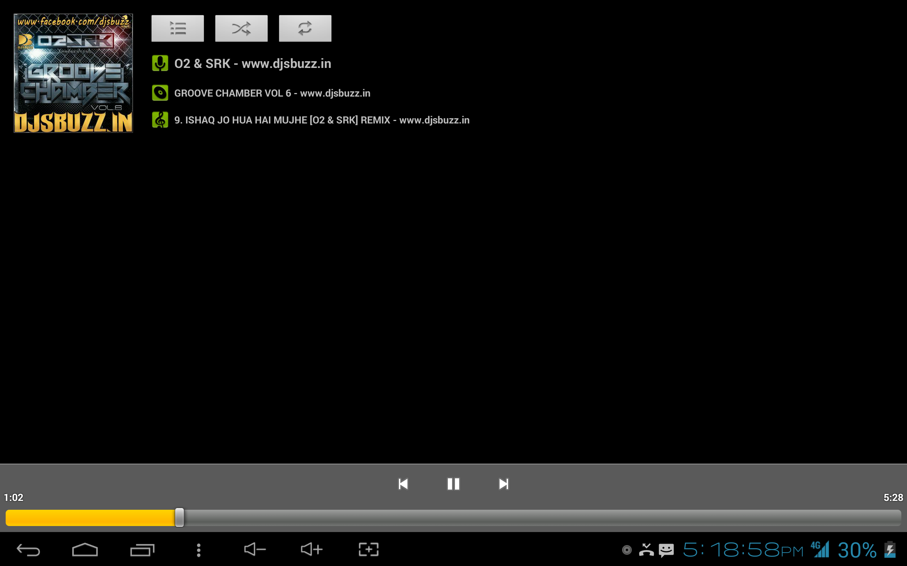
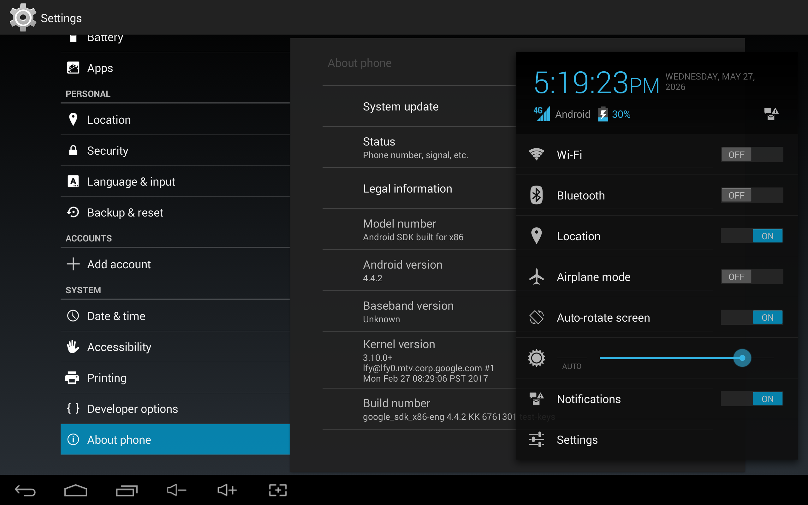

# TabletKat Revival
### Restoring the authentic ICS/JB Tablet UI to Android 4.4 KitKat

[](https://developer.android.com/about/versions/kitkat)
[](https://repo.xposed.info/)
[](https://github.com/AToha4521/TabletKatRevival/releases)

**TabletKat Revival** is a modern fork of the original [alice-mkh/tabletkat](https://github.com/alice-mkh/tabletkat) Xposed module. It restores the classic Android 4.x tablet UI on Android 4.4 KitKat while improving stability, compatibility, and visual polish.

---

## 📸 Previews

 
 
 

 
 
 
 

---

## Table of Contents
- [What is this?](#what-is-this)
- [Requirements](#requirements)
- [Key Improvements](#key-improvements)
- [Features](#features)
- [ROM Compatibility](#rom-compatibility)
- [Downloads](#downloads)
- [Building and Installation](#building-and-installation)
- [Debugging](#debugging)
- [License and Credits](#license-and-credits)

---

## What is this?
TabletKat is an **Xposed module** that overrides the phone UI on KitKat. It repositions the system bar to the bottom and reconstructs the notification and recent apps panels to match the classic tablet interface that Google deprecated after Android 4.3.

TabletKat Revival is a modern fork of the original project from [alice-mkh/tabletkat](https://github.com/alice-mkh/tabletkat). This revival improves compatibility on Android 4.4 KitKat, adds stability protections, and introduces polished tablet-style features such as high-resolution navigation icons and a native screenshot service.

---

## Requirements
| Component | Requirement |
|:---|:---|
| **Android Version** | 4.4 KitKat (API 19) **only** |
| **Framework** | Xposed Framework (v54 or newer) |
| **Access** | Root Access required |
| **Device Type** | Optimized for 7" or bigger tablets |

---

## Key Improvements

### Stability & Safety
- **SafeHook Engine**: System hooks are wrapped to catch `NoSuchMethodError`, preventing SystemUI crashes on ROMs that miss expected components like `TvStatusBar`.
- **Tablet Settings Stabilization**: The tablet settings interface was rebuilt with a Fragment-based layout for smoother behavior and fewer crashes.
- **TouchWiz Protection**: Samsung frameworks are detected automatically and risky hooks are disabled to avoid bootloops.

### Visual & Logic Fixes
- **Button Alignment**: Navigation buttons are forced to **80dip** width for consistent spacing with stock UI elements.
- **Smart Menu Button**: The overflow button appears only when needed and dispatches the native `KEYCODE_MENU` event.
- **Status Icon Polish**: `SignalClusterView` is tuned to render blue Holo icons cleanly and consistently in the status bar.

---

## Features

### Theme Styles
- **Holo Unified**: A polished ICS/JB-style theme with holographic dark navy backgrounds (`#CC1A1F2E`).
- **KitKat Stock**: Preserves stock KitKat colors and transparency while maintaining the tablet UI.

### Status Bar & Notifications
- **Compact Panel**: A right-anchored narrow notification area modeled after classic ICS tablet design.
- **Clock Seconds**: Optional high-frequency ticker with authentic AM/PM scaling.
- **Battery Customization**: Show percentage and choose between Bar, Circle, or Text battery indicators.

### Navigation Bar Extra Buttons
Add functional shortcuts to the right side of the system bar:
- **Volume +/-**: Quick audio control with custom high-resolution icons.
- **Screenshot**: Native screenshot action with live shutter animation.
- **Sleep/Power**: Short press turns the screen off; long press opens the power menu.

---

## ROM Compatibility

| ROM | Status | Notes |
|:---|:---:|:---|
| **AOSP KitKat 4.4.x** | ✅ | Perfect compatibility. |
| **CyanogenMod 11** | ⚠️ | Works, but some advanced hooks skip silently. |
| **OmniROM / AOSPA** | ⚠️ | SafeHook prevents crashes; mostly functional. |
| **TouchWiz (Samsung)** | ❌ | **Incompatible** due to framework rewrites. |
| **Lenovo VibeUI** | ❌ | **Incompatible**; causes UI glitches. |

---

## Downloads
You can find the latest stable APKs in the **[Releases](https://github.com/AToha4521/TabletKatRevival/releases)** section.

---

## Building and Installation

### Build from Source
```bash
# Clone the repository
git clone https://github.com/AToha4521/TabletKatRevival.git
cd tabletkat-revival

# Compile the APK
./gradlew assembleDebug
```
*Requires Android Studio Giraffe+ or Gradle 7.5+.*

### Installation
1. Install the APK and enable it in the **Xposed Installer**.
2. Reboot your device or use the **"Restart SystemUI"** button in TabletKat Settings.

---

## Debugging

### Logcat Filtering
Use these tags for focused debugging:
```bash
adb logcat -s "TabletKat" "TabletKat/SafeHook" "TabletKat/StatusBar"
```
For the best tablet testing environment, use a **Nexus 10** emulator image on **Android 4.4 (API 19)**.


---

## License and Credits
- **Original Author**: Exalm (alice-mkh)
- **Forked from**: [alice-mkh/tabletkat](https://github.com/alice-mkh/tabletkat)
- **Revival Developer**: Toha Abdullah
